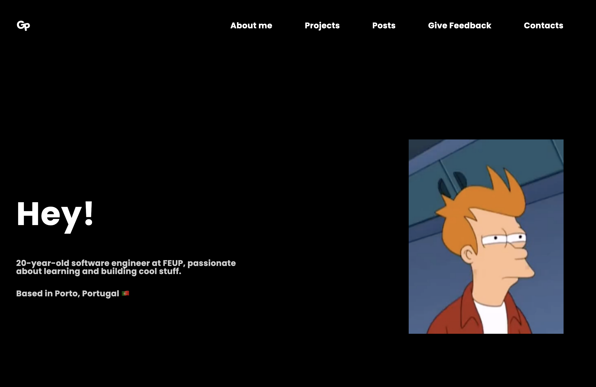
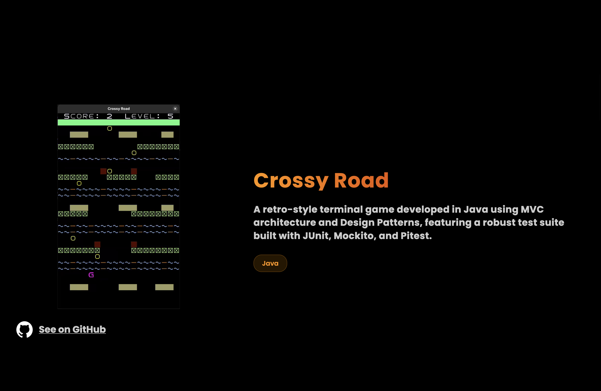
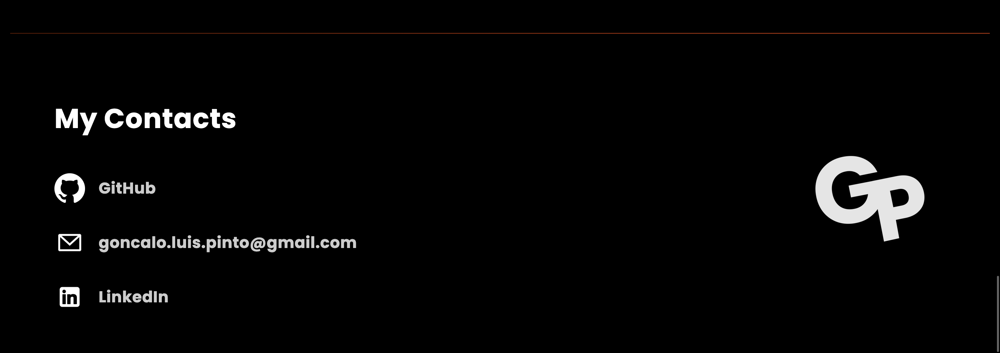

# Personal Website

## About the Project

This project was created with the purpose of improving my web development skills while combining them with other areas I already had experience in, such as database management and API consumption.

## Tech Stack

### Frontend
The frontend of this project was built using **HTML**, **CSS**, and **JavaScript**.  
It communicates with the backend through the Fetch API and includes data visualization using **Chart.js**.  
Posts support basic **Markdown rendering**, safely sanitized using **Marked** and **DOMPurify**.

### Backend
The backend was developed in **Python** using **FastAPI** to create RESTful endpoints.

Key technologies used:
- **SQLAlchemy** – database ORM
- **Pydantic** – data validation and schema definition
- **JWT** – authentication and authorization
- **Resend** – email sending service
- **Uvicorn** – ASGI server
- **CORS Middleware** – frontend/backend communication

The application uses a relational database for persistent data storage.

## Features
The website is a single-page application that contains all the information users are allowed to view and interact with. The **Home Page** is divided into several sections, including **About Me**, **Personal Projects**, **Posts**, and **Contact Me**.

The **Contact Me** section allows users to send messages directly through the website. Every time a contact is submitted, the admin receives an email notification. When the admin replies, the user also receives an email response.

All **Projects**, **Contacts**, and **Posts** are managed through a protected **Admin Page**. Access to this page and all administrative actions is secured using token-based authentication. To obtain a token, the admin must log in through the **Admin Login Page** using valid credentials.

From the Admin Page, it is possible to:
- Mark contacts as read
- Respond to or delete contacts
- View charts such as **Number of Contacts per Week** and **Read vs Unread Contacts**
- Create, edit, and delete posts

Whenever a post is created or edited, the admin also receives an email containing the post content.

Additionally, the admin has access to a **Filters Page**, which allows filtering contacts for faster lookup and management.

## Screenshots

<p align="center" justify="center">

</p>
<p align="center">
  <b><i>Fig. 1  About me section </i></b>
</p>

<p align="center" justify="center">

</p>
<p align="center">
  <b><i>Fig. 2  Projects Section </i></b>
</p>

<p align="center" justify="center">

</p>
<p align="center">
  <b><i>Fig. 3  Posts section</i></b>
</p>

<p align="center" justify="center">

</p>
<p align="center">
  <b><i>Fig. 4  Contacts section </i></b>
</p>

## How to Run Locally
Follow these steps to run the project on your local machine.

---

## 1️⃣ Clone the repository

```bash
git clone https://github.com/your-username/website.git

cd website
```

## 2️⃣ Install dependencies
**Backend (Python)**

Make sure you have Python 3 installed

```bash 
pip3 install -r backend/requirements.txt
```

**Frontend**

```bash
npm install 
```

## 3️⃣ Create a .env file
Copy the example environment file and fill in your own values:

```bash
cd backend
cp .env.example .env
```
Edit .env to configure admin email, JWT secret, or other optional values.

If you leave them blank, the project will still run locally, but admin login and email features will be disabled.

## 4️⃣ Run the backend server
Open a terminal in the `backend` folder and run:

```bash
uvicorn main:app --reload --port 8000
```

The backend will now be running at: http://localhost:8000

## 5️⃣ Run the frontend

Open another terminal in the project root and run:

```bash
python3 -m http.server 3000
```

The frontend will now be available at: http://localhost:3000

## 6️⃣ Open the project in your browser

- Home page: http://localhost:3000/home-page.html

- Admin page (requires token): http://localhost:3000/pages/admin.html

If admin credentials are not set in .env, admin login will not work.
## Environment Variables

This project requires environment variables to run properly.
Sensitive information such as API keys and admin credentials are stored in a `.env` file and are not included in the repository.

To enable admin authentication and email features, create a `.env` file based on `.env.example`.

Without these variables, the application will still run, but admin access and email notifications will be disabled.

## Future Improvements
My main goal for the future is to implement tests for all the features in the code.
